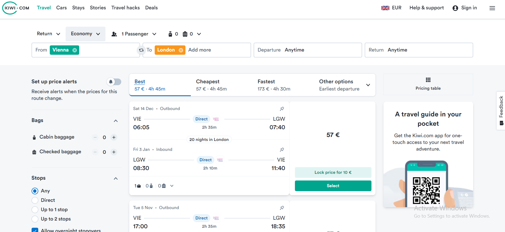
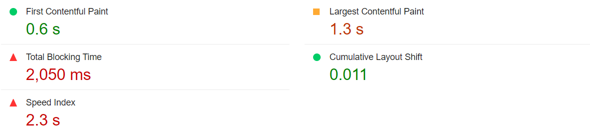
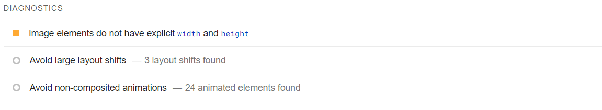
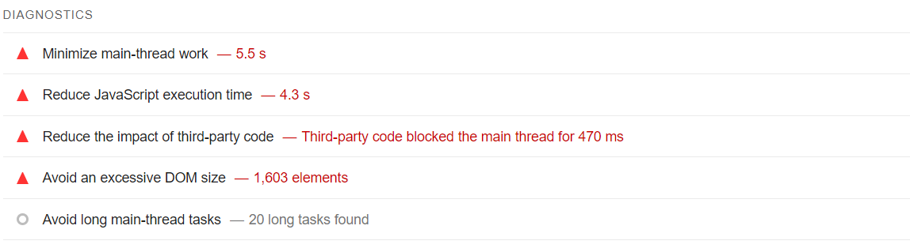
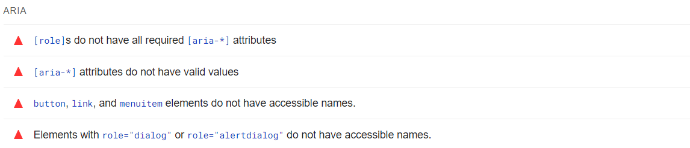
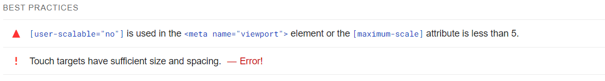
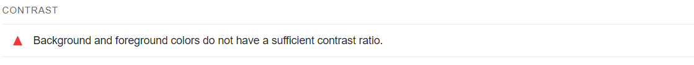
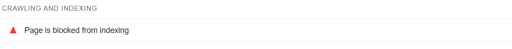
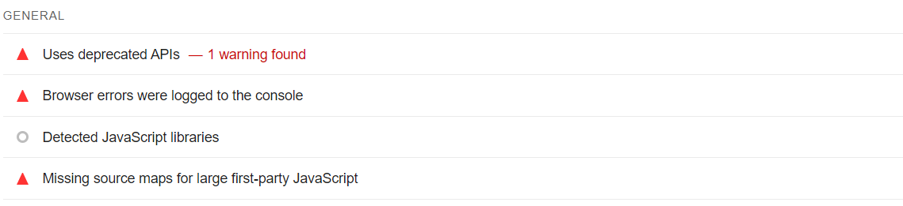
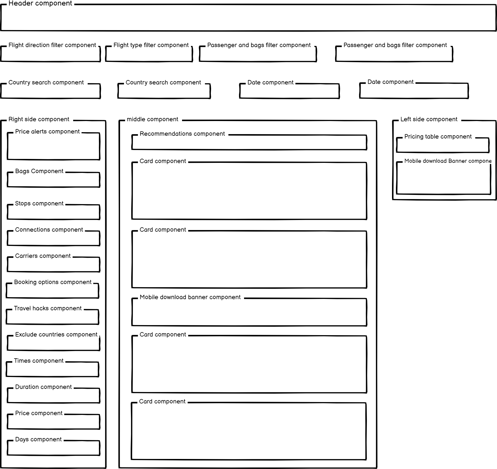

# KIWI's website performance

### Is optimization important?
Yes, optimization is very important for several reasons:

Search engines like Google take loading speed into account when ranking websites.
**Hosting cost:** Optimizing performance reduces the amount of data sent, which helps reduce the cost of hosting or traffic fees.
**User experience:** A faster website means a better experience, and this helps reduce the bounce rate.

### How to measure it?
**Lighthouse** and **PageSpeed Insights** are powerful tools for measuring performance.
Local measurement with Lighthouse is a good place to start, but it's best to use tools that measure performance from different geographic locations like **WebPageTest** or **Chrome User Experience Report** to see what users in Canada or elsewhere are experiencing.

## Core Web vitals
we analysis this website [Kiwi.com](https://www.kiwi.com/en/search/results/vienna-austria/london-united-kingdom/anytime/anytime)

### Diagnose performance issues

### Metrics

### LCP (Largest Contentful Paint):
 Measures the load time of the largest element on the page (e.g., an image or video).

 **Reduce unused JavaScript:** Reduce unused JavaScript and defer loading scripts until they are required to decrease bytes consumed by network activity
- **Code splitting & modules lazy loading**
The JS & CSS are better to split them up depending on the page to load faster.
- **Tree shaking** 
It is a term commonly used in the JavaScript context for dead-code elimination.
**Resources:** 
https://vuejs.org/guide/best-practices/performance#code-splitting
https://vuejs.org/guide/best-practices/performance#bundle-size-and-tree-shaking

**Largest Contentful Paint element** 

**Reduce unused CSS**
- **Unused code**
Tools like **PurgeCSS** and Webpack plugins can help extract unused code.

### CLS (Cumulative Layout Shift):
 Measures the stability of the design, meaning whether or not elements move during loading.

- **Image elements do not have explicit *width* and *height***
Set an explicit width and height on image elements to reduce layout shifts and improve CLS.

**Resources**
https://gtmetrix.com/use-explicit-width-and-height-on-image-elements.html
https://dev.to/grahamthedev/quick-tips-how-to-fix-image-elements-do-not-have-explicit-width-and-height-in-page-speed-insights-lighthouse-3776

### TBT (Total blocking time): 
An indicator of page interaction performance.
 

**Reduce JavaScript execution time:**
- Only send the code that your users need by implementing code splitting.
- Minify and compress your code: 
**Files minify:** Minification makes a difference because it reduces file size and improves loading speed
**Compressing files with gzip or brotli:** It's important to compress HTML, JS, and CSS files to make them smaller. Browsers support automatic decompression.
- Remove unused code.
- Reduce network trips by caching your code with the PRPL pattern:
**TTL for cache:** Increasing the TTL helps reduce the load on the server, thus improving performance.

**Reduce the impact of third-party code**
- Use web worker: ***Partytown*** is a lazy-loaded library to help relocate resource intensive scripts into a web worker, and off of the main thread.
**Resources:**
https://medium.com/@shivam_99875/boosting-javascript-web-performance-with-partytown-82c510f8a88a

**Minimize main-thread work**
- Preload, prefetch and preconnect
*preload:* load content that's required for the intial render.
*prefetch:* load content that may be needed to render the next page.
*preconnect:* establish a server connection without loading a specific resource yet.
**Resources**
https://onur.dev/writing/optimizing-website-speed-with-preload-prefetch-preconnect-and-dns-prefetch

- Async Loading JS files: We can defer loading unnecessary JS using `async` or `defer`.
**Resources**
https://dev.to/fidalmathew/async-vs-defer-in-javascript-which-is-better-26gm

**Avoid an excessive DOM size**
- the deeper the DOM and the more elements, the more it affects performance and rendering time.
**Resources:**
https://nitropack.io/blog/post/avoid-an-excessive-dom-size
---

## Enhancing performance ideas

### lazy loading images
Images that appear above the fold (at the top of the screen) cannot be lazy loaded because they need to appear quickly to optimize the LCP.

**Resources:** 
https://web.dev/articles/browser-level-image-lazy-loading

### Responsive Images
The collection of image files a user agent (e.g. a web browser) can choose from. It's like a competition of images — you provide a set of images for one image location on a web page, and the browser of each user picks and downloads the one that best fits its needs.

**Resources:**
 https://developer.mozilla.org/en-US/docs/Learn/HTML/Multimedia_and_embedding/Responsive_images

### WebP and AVIF
Using WebP or AVIF makes a big difference in the size of the images compared to JPEG or PNG. AVIF usually compresses images better than WebP.
**Resources:**
https://www.smashingmagazine.com/2021/09/modern-image-formats-avif-webp/
### CDN (Content Delivery Network): 
A content distribution network that allows files to be served from the closest server to the user, thereby minimizing load times.
Using a CDN is better if the files are static and you have a lot of visitors from different geographical areas because it reduces latency.

### Load of fonts
we can use the `font-display:swap` technique to make the content appear in a fallback font until the primary font finishes loading.

**Resources:**
https://www.smashingmagazine.com/2021/05/reduce-font-loading-impact-css-descriptors/

### cache busting
We change the name of the file every time we upload it, to ensure that visitors see the updates.

---

### Accessibility
These checks highlight opportunities to improve the accessibility of your web app.

**Resources:**
 https://www.acquia.com/blog/ways-to-improve-web-accessibility

---

### SEO

**Resources:**
https://developer.chrome.com/docs/lighthouse/seo/is-crawlable

---

### Best Practices

---

### Page wireframe
https://www.kiwi.com/en/search/results/vienna-austria/london-united-kingdom/anytime/anytime
- UI elements like input fields and checkboxes, etc... is shared in all over the app.
- Some components containing same content can be same component with changing props.

